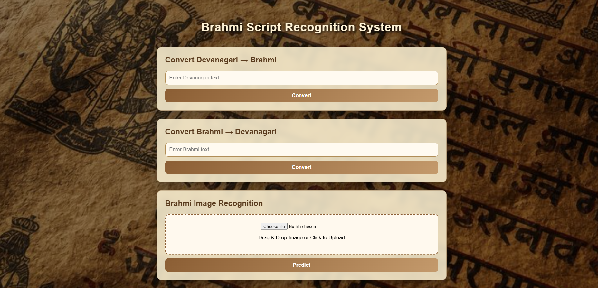
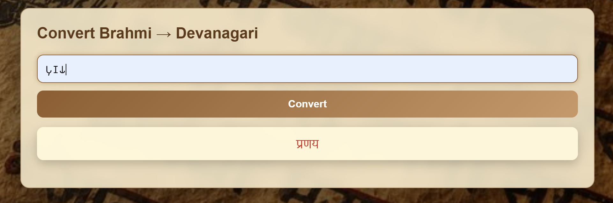
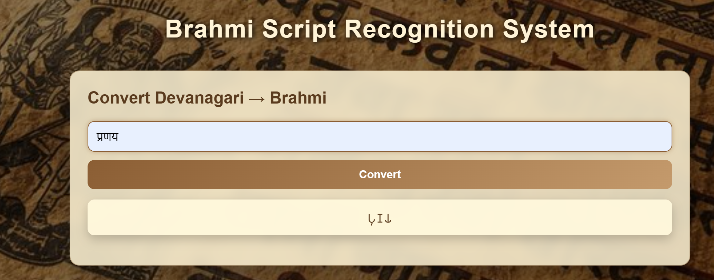
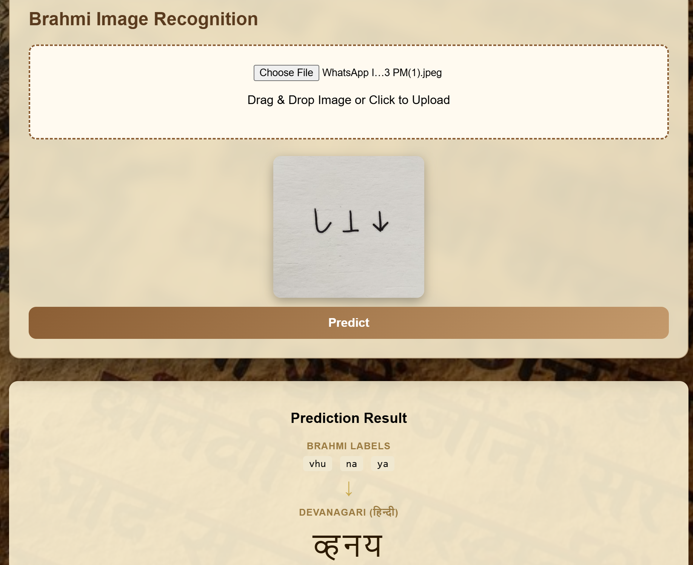

# 🪨 Brahmi Script Translation & Inscription Analysis System

An AI-powered deep learning system designed for ancient Brahmi script translation and damaged inscription analysis Project focused on cultural heritage digitization and intelligent inscription processing.

The project integrates Computer Vision, OCR, Deep Learning and Natural Language Processing techniques to analyze ancient inscriptions and perform high-accuracy script translation.

The project includes the following modules

- 🔤 Brahmi → Devanagari Translation
- 🔁 Devanagari → Brahmi Translation
- 🖼️ Image-Based Brahmi Inscription Analysis

This system combines image processing, OCR pipelines and neural network-based prediction models to digitize and preserve historical inscriptions.

---

# 🎯 Project Overview

Ancient Brahmi inscriptions are challenging to interpret manually because of

- damaged stone surfaces
- incomplete characters
- weathered inscriptions
- low-quality inscription images
- limited digitized datasets

This project provides an AI-driven pipeline capable of

- recognizing Brahmi characters from inscription images
- translating between Brahmi and Devanagari scripts
- restoring damaged inscriptions
- performing OCR-based inscription analysis
- improving readability of ancient scripts using deep learning

The platform was developed as a research-oriented heritage preservation system using modern artificial intelligence and computer vision techniques.

---

# 📦 Full Project Download

Due to GitHub size limitations, the complete project including trained models and datasets is available through Google Drive.

[Google Drive - Full Brahmi Project](https://drive.google.com/drive/folders/1jHSGaGns544CBPvVRvDgW1iuRKo1UDbt?utm_source=chatgpt.com)

---

# 🏠 Application Home Page



---

# 🚀 System Modules

# 🔤 Module 1 — Brahmi → Devanagari Translation

This module converts ancient Brahmi script into readable modern Devanagari text using deep learning-based sequence prediction techniques.

## Features

- Character-level translation
- Sequence prediction
- Neural mapping between scripts
- High-accuracy script conversion
- OCR-assisted translation workflow

## Accuracy

```text
Approximately 94–98%
```

## Screenshot



---

# 🔁 Module 2 — Devanagari → Brahmi Translation

This module performs reverse translation from Devanagari into Brahmi script and generates corresponding ancient script characters.

## Features

- Ancient character generation
- Character sequence mapping
- Bidirectional translation support
- Deep learning-based prediction
- Script reconstruction workflow

## Accuracy

```text
Approximately 94–98%
```

## Screenshot



---

# 🖼️ Module 3 — Brahmi Inscription Image Analysis

This module analyzes uploaded Brahmi inscription images and predicts ancient text from damaged or partially visible inscriptions.

## Features

- Image preprocessing
- Character segmentation
- OCR pipeline
- CNN-based character recognition
- Connected component analysis
- Damaged inscription restoration

## Accuracy

```text
Approximately 78–90%
```

## Screenshot



---

# 📊 Accuracy Metrics

| Module | Accuracy |
|--------|----------|
| Brahmi → Devanagari Translation | 94–98% |
| Devanagari → Brahmi Translation | 94–98% |
| Image-Based Brahmi Analysis | 78–90% |

---

# 🧱 Tech Stack

# ⚙️ Backend & AI Technologies

- Python
- Flask
- TensorFlow
- Keras
- OpenCV
- NumPy
- Pandas
- Scikit-learn

---

# 🌐 Frontend Technologies

- HTML5
- CSS3
- Bootstrap
- JavaScript
- Jinja2 Templates

---

# 🧠 Deep Learning & Computer Vision

- Convolutional Neural Networks (CNN)
- OCR Processing Pipeline
- Image Segmentation
- Character Recognition
- Ancient Script Analysis
- Connected Component Extraction
- MobileNet-Based Architecture

---

# 🗄️ Dataset & Processing

- Custom Brahmi Script Dataset
- Ancient Inscription Image Dataset
- Data Augmentation Techniques
- Character Segmentation Pipeline
- Image Enhancement & Noise Removal

---

# 📁 Project Structure

```text
final_bramhi/
│
├── app.py                           # Main Flask application
├── final.py                         # Prediction pipeline
├── recognize_character.py           # Character recognition logic
├── image_preprocessing.py           # Image preprocessing module
├── retrain.py                       # Model retraining
├── test_ocr.py                      # OCR testing pipeline
├── requirements.txt                 # Project dependencies
├── README.md
│
├── templates/                       # HTML templates
├── static/                          # CSS, JS, and assets
├── screenshots/                     # Project screenshots
├── models/                          # Trained models
├── Metrics/                         # Accuracy metrics and evaluation
├── Segmentation/                    # Character segmentation pipeline
├── ConnectedComponents/             # Component extraction logic
│
└── complete_pipeline.ipynb          # End-to-end OCR workflow notebook
```

---

# ⚙️ Installation & Setup

# 🧩 Prerequisites

- Python 3.10+
- pip
- Virtual Environment
- TensorFlow Compatible System

---

# 📦 Clone Repository

```bash
git clone https://github.com/PranayChavan2004/brahmi-translation-system.git
```

```bash
cd brahmi-translation-system
```

---

# 🐍 Create Virtual Environment

```bash
python -m venv venv
```

Activate the virtual environment

## Windows

```bash
venv\Scripts\activate
```

## Linux / Mac

```bash
source venv/bin/activate
```

---

# 📥 Install Dependencies

```bash
pip install -r requirements.txt
```

---

# ▶️ Run Application

```bash
python app.py
```

Application runs at

```text
http://127.0.0.1:5000
```

---

# 🧠 OCR and Translation Workflow

The complete OCR and translation workflow consists of

1. Image Upload
2. Image Preprocessing
3. Noise Removal
4. Character Segmentation
5. Connected Component Extraction
6. Character Recognition
7. Translation Prediction
8. Final Script Generation

---

# ✨ Key Capabilities

- Ancient script digitization
- Damaged inscription restoration
- OCR for historical inscriptions
- Bidirectional script translation
- AI-driven cultural heritage preservation
- Intelligent inscription analysis
- Automated character prediction

---

# 📌 Research Contribution

This project contributes to research areas including

- Ancient inscription digitization
- Historical document preservation
- OCR for low-resource ancient languages
- Deep learning-based damaged text restoration
- AI-assisted cultural heritage analysis
- Ancient script recognition systems

---
